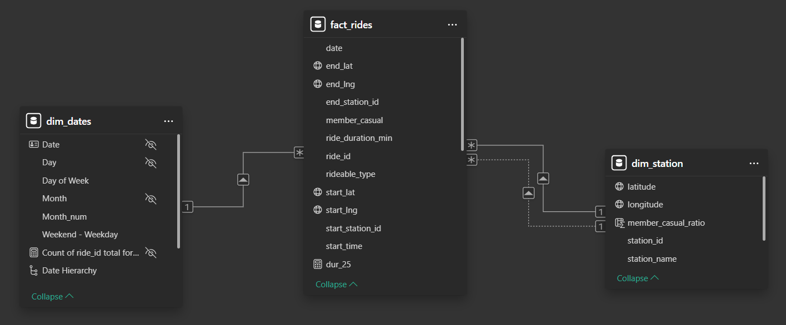

# Bike-Sharing Customer Segmentation Analysis

## Overview
A comprehensive data analysis project examining over 5.8 million bike rides to identify key behavioral differences between annual members and casual riders. This analysis provides strategic recommendations to convert casual riders into long-term members.

## Key Findings

### When They Ride
- **Seasonal Patterns**: Both user groups follow similar seasonal patterns, but casual riders show more pronounced seasonality
- **Weekly Patterns**: Members predominantly ride on weekdays while casual riders favor weekends
- **Hourly Patterns**: Members show distinct commute peaks in mornings and evenings on weekdays, while casual riders follow afternoon-centered patterns

### How They Ride
- **Duration**: Casual riders take significantly longer trips (20 min avg) compared to members (12 min avg)
- **Equipment**: Both groups show nearly identical bike type preferences, ruling out equipment as a differentiator

### Where They Ride
- **Geographic Focus**: Casual riders concentrate along tourist corridors and waterfront areas
- **High-Potential Locations**: Analysis identified 25 stations with balanced member/casual usage ratios that represent prime conversion opportunities

## Project Workflow

1. **Data Collection**: Extracted 12 months of ride data (January 2024-June 2024) using Python
2. **Data Cleaning**: Processed raw data in BigQuery using SQL, removing outliers and creating analytical tables
3. **Data Modeling**: Developed a structured dimensional model in Power BI (custom date table was added)  

*Data model*  
  

4. **Exploratory Analysis**: Created visualizations to identify patterns in temporal, behavioral, and spatial dimensions
5. **Statistical Testing**: Applied hypothesis testing (t-test, chi-square, K-S test) to validate observed differences
6. **Strategic Recommendations**: Developed targeted conversion strategies based on analytical findings

## Tools

- **SQL**: Data cleaning, transformation, and aggregation in BigQuery
- **Python**: Statistical testing, data manipulation with pandas and scipy
- **Power BI**: Data modelling using a star schema, data visualizations and report creation
- **Statistical Analysis**: Hypothesis formulation and testing, statistical validation of findings

## Repository Structure

- `/data` - Data processing scripts and information
- `/sql` - SQL queries for data cleaning and transformation
- `/notebooks` - Jupyter notebook which includes the analytical report
- `/images` - Visualizations and charts

## Analysis Files

This repository contains the bike-sharing analysis in two complementary formats:

* [**Analysis Report**](analysis.md) - Complete analysis with all visualizations and findings in an easily readable format
* [**Analysis Notebook**](notebooks/analysis.ipynb) - Jupyter notebook containing the complete analysis with code for statistical tests and data processing

> **Note:** Images within Jupyter notebooks may not render correctly when viewed directly on GitHub. The [Analysis Report](analysis.md) provides the complete analysis with all visualizations properly displayed.