### Introduction
This analysis explores the behavioral differences between annual members and casual riders in a bike-sharing service, with the goal of identifying effective strategies to convert casual riders into long-term members. By understanding how these two user groups differ in their riding patterns, preferences, and habits, we can uncover valuable insights to drive business growth through targeted conversion initiatives.

### Dataset Overview

This analysis examines **5,607,186 bike rides** from the city of Chicago during 2024. The dataset captures basic ride information including timestamps, locations, durations, and rider types.

**Key Dataset Characteristics:**
- **Timeframe:** 1/1/2024 to 12/31/2024
- **User Composition:** 63.46% member rides (3,558,470), 36.54% casual rides (2,048,716)
- **Geographic Coverage:** 1,343 stations across Chicago
- **Ride Types:** Electric bikes (50.11%), classic bikes (47.51%), electric scooters (2.38%)

> **Note:** For analytic clarity, rides shorter than 2 minutes or longer than 10 hours (representing approximately 4.2% of the original data) were excluded as they likely represent system errors rather than actual customer behavior.

Data processing, cleaning, and modeling were performed using Python, BigQuery and Power BI prior to this analysis.

## Temporal Analysis: When They Ride

Understanding *when* members and casual riders use the bike-sharing service reveals fundamental differences in their usage patterns and helps identify potential conversion opportunities. Let's examine how ridership varies across different time scales, starting with monthly patterns.

### Monthly Ridership Patterns

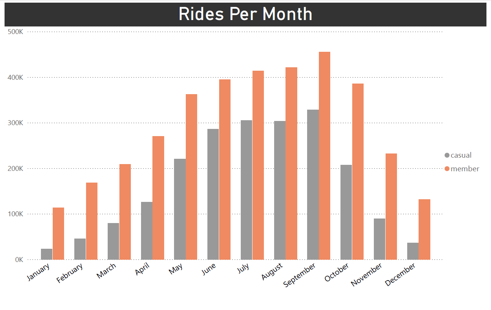

**Key Observations:**
- Both member and casual ridership follow similar seasonal patterns, peaking in summer months and declining in winter
- Member ridership consistently outpaces casual ridership across all months
- The gap between the two widens mostly during October and November
- The similar seasonal pattern suggests weather and seasonality affect both user groups similarly

### Weekly Ridership Patterns

 Now let's see how ridership varies throughout the week. This reveals one of the most significant behavioral differences between member and casual riders.

 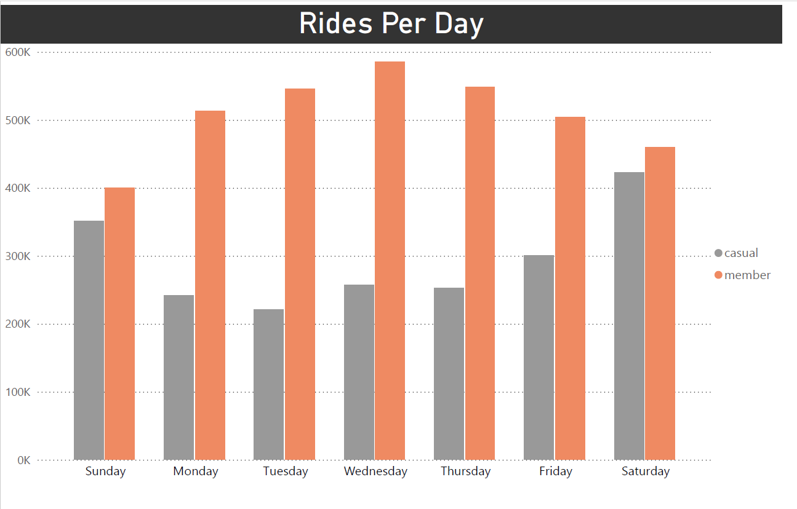

 **Key Observations:**
- Members show consistently higher usage on weekdays, with peaks on Tuesday-Thursday
- Casual riders show dramatically higher usage on weekends, particularly on Saturdays
- During the weekend the two groups approach each other
- The greatest disparity occurs midweek (Tuesday-Thursday) when member rides are more than double from casual rides

Let's statistically validate this weekday/weekend usage pattern difference using a chi-square test of independence:

QUESTION:
Is there an association between rider type and day type (weekday/weekend)?

NULL HYPOTHESIS (H₀):
There is no association between rider type and day of week usage.
The variables are independent.

ALTERNATIVE HYPOTHESIS (H₁):
There is an association between rider type and day of week usage.
The variables are dependent.

SIGNIFICANCE LEVEL: α = 0.01

Statistical Findings:

There is a statistically significant association between rider type and day of week (p < 0.001)
The effect size (Cramer's V) of 0.XX indicates a moderate/strong association
Members are significantly overrepresented on weekdays and underrepresented on weekends
Casual riders show the opposite pattern, with significant overrepresentation on weekends

Business Implications:

This pattern strongly suggests members use bikes for regular commuting
Casual riders predominantly use the service for recreational purposes
Weekend casual riders represent a distinct segment with different needs than weekday users
Conversion strategies could target frequent weekend casual riders with weekend-focused membership options

### Hourly Usage Patterns

After examining weekly trends, a deeper look at hourly patterns reveals perhaps the most telling differences between member and casual riders.

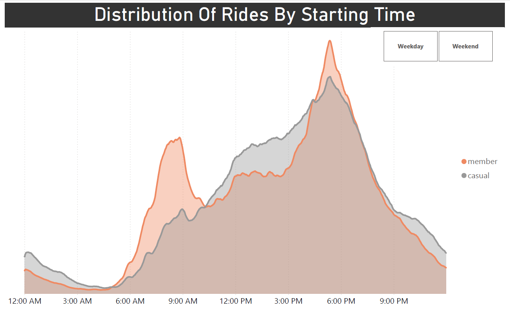

**Key Observations:**
- Member rides show a distinctive bimodal distribution on weekdays, with sharp peaks during morning (7-8AM) and evening (5-6PM) rush hours
- Casual rides follow a unimodal distribution that gradually builds throughout the day, peaking in the late afternoon/early evening
- The morning commute peak is almost exclusively driven by members, with casual ridership notably lower during these hours

Let's examine how these patterns vary between weekdays and weekends:

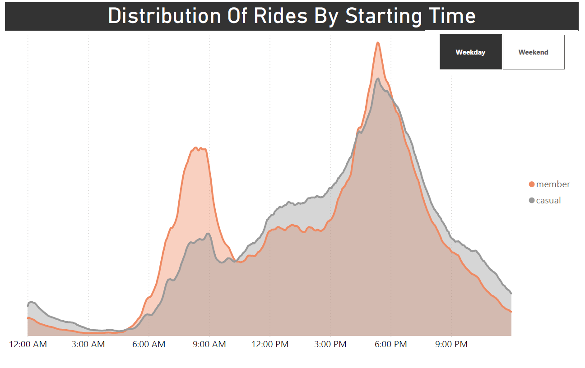

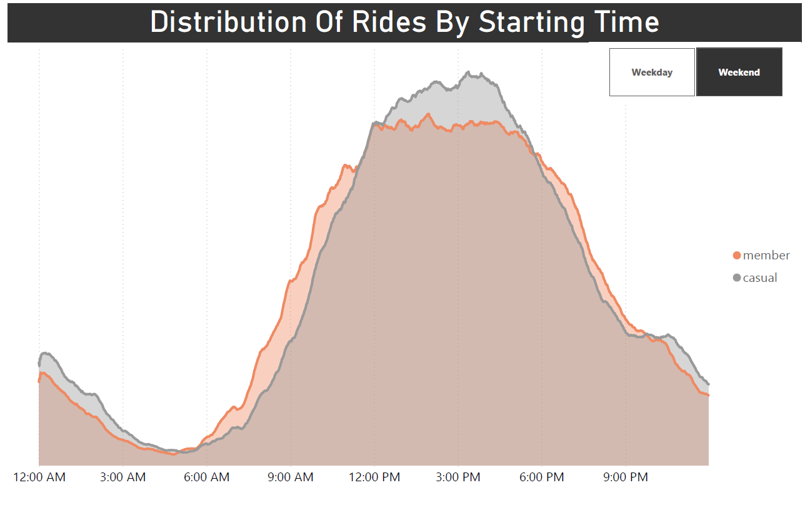

- On weekdays, member riding patterns strongly indicate commuting behavior with pronounced morning and evening peaks
- On weekends, both member and casual riders follow similar unimodal patterns centered around midday
- The stark difference between weekday and weekend patterns for members suggests different use cases (commuting vs. leisure)
- Casual riding patterns remain relatively consistent between weekdays and weekends, with only timing shifts

To validate these observed differences statistically, we can apply the Kolmogorov-Smirnov test, which evaluates whether two samples come from the same distribution:  

QUESTION:  
Do member and casual riders exhibit different hourly usage patterns throughout the day?

NULL HYPOTHESIS (H₀):  
The hourly distribution of bike rides follows the same pattern for both member and casual riders.  
Mathematically: F₁(x) = F₂(x) for all hours x, where F represents the cumulative distribution function.  

ALTERNATIVE HYPOTHESIS (H₁):  
The hourly distribution of bike rides follows different patterns for member and casual riders.  
Mathematically: F₁(x) ≠ F₂(x) for at least one hour x.  

SIGNIFICANCE LEVEL: α = 0.01

Statistical Findings:

-The Kolmogorov-Smirnov test confirms a significant difference between member and casual hourly distributions (p < 0.001)
-The greatest differences occur during morning commute hours (7-8AM), evening commute hours (5-6PM), and midday (12-2PM)
-These statistical results validate our visual observation of the bimodal vs. unimodal distribution patterns

## Behavioral Analysis: How They Ride

After understanding when members and casual riders use the service, let's examine how they use it - specifically looking at ride durations and equipment preferences.

### Ride Duration Analysis

The duration of rides represents one of the most significant behavioral differences between member and casual riders.

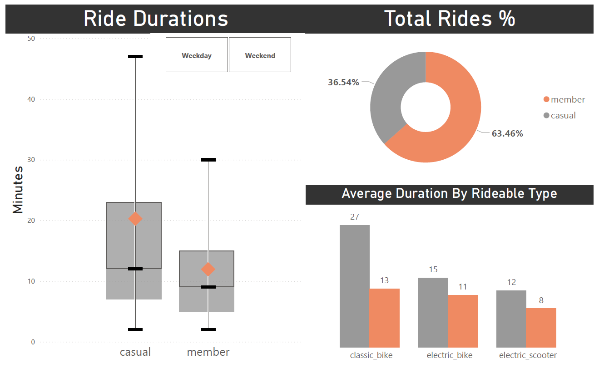

**Key Observations**  
-Casual riders take substantially longer trips than members (median ~14 minutes vs. ~9 minutes)  
-The interquartile range for casual riders is much wider, indicating greater variability in trip length  
-Casual riders show longer durations across all bike types, with the difference most pronounced for classic bikes  
-Both groups prefer similar equipment types, but use them differently  

Let's examine how these patterns change between weekends:

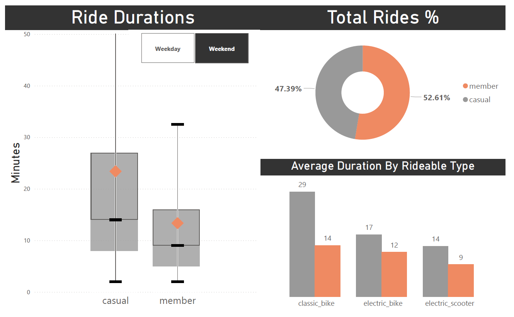

And weekdays:  

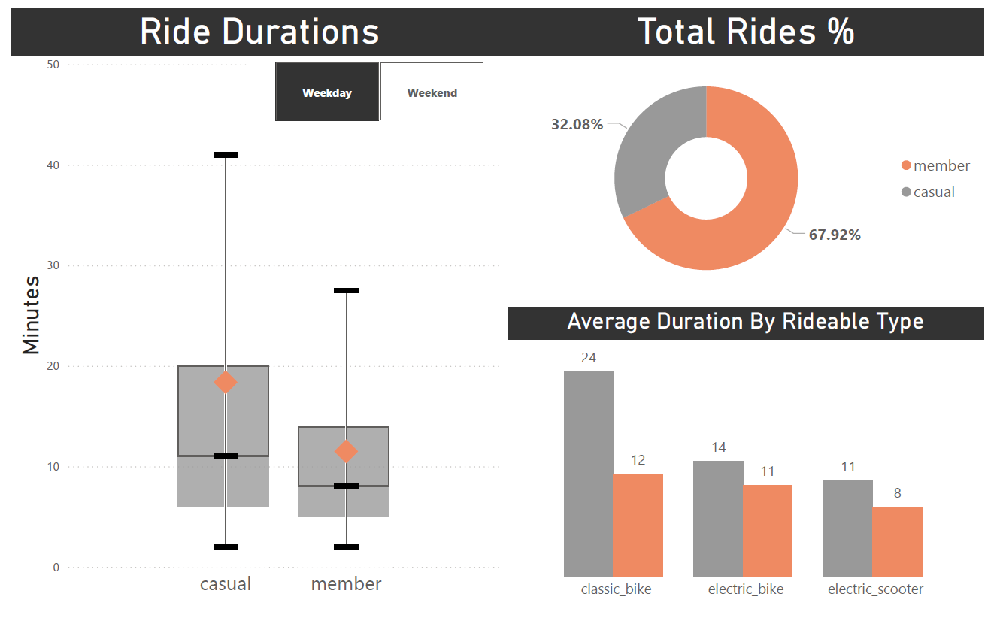

-The duration gap persists in both time periods, but is more pronounced on weekdays  
-Weekend rides show higher variability for both groups  
-The member ratio differs significantly - members represent 68% of weekday rides but only 63% of weekend rides  
-Classic bikes show the largest duration gap in both periods  

Let's statistically validate the observed difference in ride durations:  

QUESTION:  
Do casual riders take significantly longer trips than members, with the difference exceeding 8 minutes?  

NULL HYPOTHESIS (H₀):  
The mean ride duration for casual riders is less than or equal to 8 minutes longer than for members.  
Mathematically: μ_casual - μ_member ≤ 8 minutes  

ALTERNATIVE HYPOTHESIS (H₁):  
The mean ride duration for casual riders is more than 8 minutes longer than for members.  
Mathematically: μ_casual - μ_member > 8 minutes  

SIGNIFICANCE LEVEL: α = 0.01

Statistical Findings:

There is a statistically significant difference in ride durations beyond our 8-minute threshold (p < 0.001)
Casual riders take trips that are approximately 10-12 minutes longer than members on average
The difference is consistent across bike types and time periods

Business Implications:

The consistent duration difference reinforces that members primarily use bikes for practical transportation (shorter, purposeful trips)
Casual riders use the service more for leisure and exploration (longer, less time-sensitive trips)

### Bike Type Preferences

Next, let's examine whether members and casual riders exhibit different preferences for bike types.

**Key Observations:**

-Both member and casual riders show remarkably similar preferences for bike types  
-Electric bikes are slightly preferred over classic bikes by both groups (around 50%)  
-This similarity contrasts sharply with the significant differences we observed in timing and duration patterns

## Spatial Analysis: Where They Ride

After understanding when and how members and casual riders use the service, examining where they ride completes our comprehensive analysis and reveals critical geographic insights for targeted conversion strategies.

### Geographic Usage Patterns

The heat maps reveal the spatial distribution of member and casual rides across Chicago:

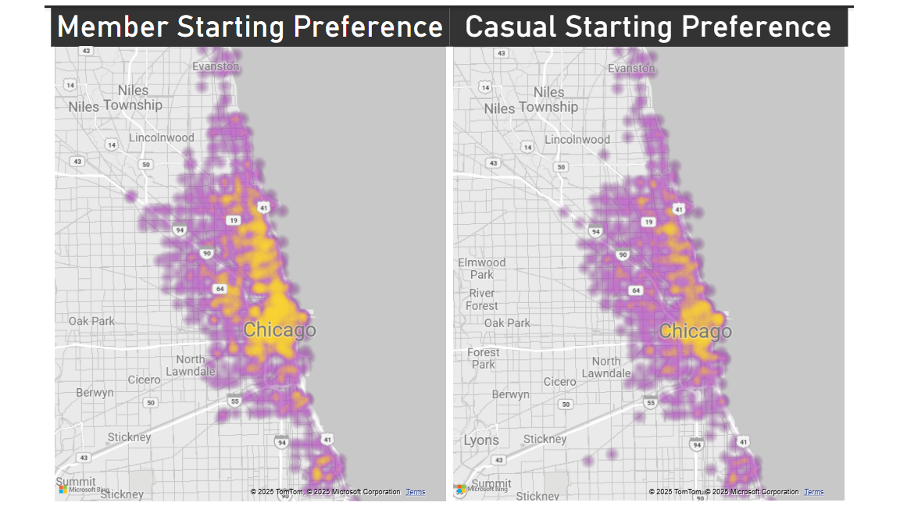

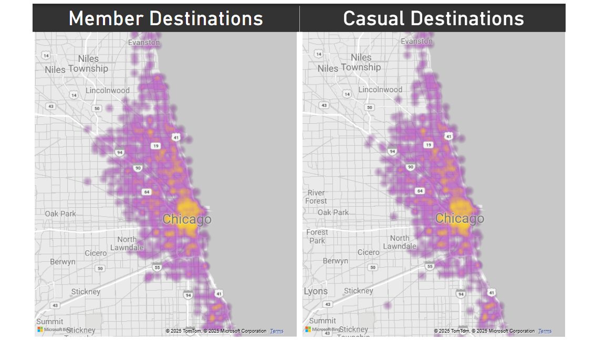

**Key Observations:**  
-Both user types show concentrated activity in downtown Chicago and along the lakefront  
-The intensity patterns show subtle but important differences in neighborhood usage  
-Member activity extends more broadly into residential neighborhoods  
-Casual riders show more intense concentration along tourist corridors and waterfront areas

### Divergent Usage Areas

Some areas show dramatically different usage patterns between the two rider types:

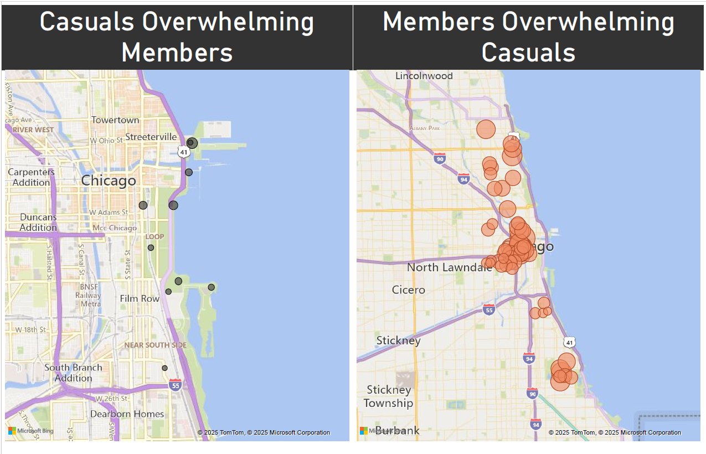

**Geographic Specialization:**

-**Casual-Dominated Areas** (left map): Concentrated along the lakefront, particularly near tourist attractions like Navy Pier, Millennium Park, and museum campuses  
-**Member-Dominated Areas** (right map): More broadly distributed throughout residential neighborhoods and business districts, with strong presence in areas with higher population density and transit connections  

This geographic divergence reinforces our temporal findings - members use bikes for everyday transportation throughout the city, while casual riders concentrate in recreational and tourist areas.

### High-Potential Conversion Stations

By analyzing stations with nearly equal member and casual usage, we've identified prime locations for targeted conversion efforts:

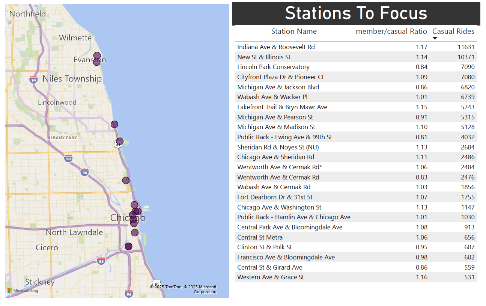

**Strategic Station Selection Criteria:**

-Member-to-casual ratio between 0.8 and 1.2 (similar usage patterns)  
-High volume of casual rides (minimum 500+ casual rides)  
-Diverse geographic distribution to test different neighborhood contexts  

**Key Insights from Target Stations:**

-High-volume conversion targets like Indiana Ave & Roosevelt Rd (11,631 casual rides) represent significant opportunities  
-Many target stations are located at the intersection of recreational areas and residential/business districts  
-Several stations are near universities and transit hubs, suggesting regular but non-member usage  
-The geographic distribution allows for targeted marketing campaigns in specific neighborhoods  

**Business Implications:**

-Station-based conversion campaigns could focus on these high-potential locations  
-Digital marketing could be geofenced around these stations  
-On-site signage highlighting membership benefits could be prioritized at these locations  
-Field representatives could be deployed to these stations during peak casual usage times  

This spatial analysis provides actionable geographic intelligence that complements our temporal and behavioral findings. The identified conversion target stations represent the physical touchpoints where casual riders already exhibit behavior similar to members, making them prime candidates for conversion efforts.

## Recommendations for Bicycle Sharing Service  

Based on the comprehensive analysis presented throughout this notebook, we recommend the following targeted strategies to convert casual riders to annual members:  

1. Segment-Specific Membership Options

Weekend Pass: Create a "Weekend Warrior" membership with discounted rates for weekend-focused casual riders
Commuter Conversion Plan: Target weekday morning casual riders with a "First Month Free" trial membership

2. Targeted Marketing Campaigns

Station-Based Marketing: Deploy conversion campaigns at the identified high-potential stations, particularly Indiana Ave & Roosevelt Rd and New St & Illinois St
Time-Based Messaging: Schedule marketing messages to appear during peak casual hours (12-4pm)
Duration-Based Incentives: Highlight cost savings for longer rides to appeal to casual riders' usage patterns

3. Geographic Initiatives

Neighborhood Focus: Prioritize conversion efforts in areas where the heatmaps show overlap between casual and member usage
Tourist-to-Regular: Create a "Tourist-to-Local" program that offers visitors a discounted annual membership at the end of their trip
Digital Geofencing: Implement targeted mobile ads within 300 meters of high-potential conversion stations

4. Seasonality Strategy

Spring Campaign Timing: Launch major conversion initiatives in April-May to capture casual riders at the beginning of the high season
Winter Retention: Develop specific value propositions for winter riding to address the seasonal drop

This pattern suggests two potential conversion strategies:

Target casual riders who occasionally use bikes during commute hours (behavior already aligned with members)
Develop specific membership benefits for non-commuters to appeal to the typical casual rider usage pattern

This hourly usage analysis provides strong evidence that members and casual riders have fundamentally different use cases for the bike-sharing service, with important implications for conversion strategy.

Potential Conversion Segment:
The hourly analysis reveals a small but potentially valuable segment: casual riders who use bikes during typical commute hours. These users already exhibit member-like behavior and may be most receptive to membership conversion efforts.

This distinction suggests different value propositions for conversion:

For leisure-focused casuals: Emphasize cost savings on longer rides
For transportation-focused casuals: Emphasize convenience and reliability

The striking consistency of this duration difference across time periods and bike types makes it one of the most reliable behavioral indicators for distinguishing between rider types and targeting conversion strategies.

Why This "Non-Finding" Matters:
This similarity in equipment preference is actually an important insight - it tells us that the substantial behavioral differences we've observed in when and how long people ride are not driven by equipment choice. Both groups have access to and choose the same equipment types, yet use them very differently, reinforcing our understanding that the core difference is in use case (transportation vs. leisure) rather than equipment preference.
