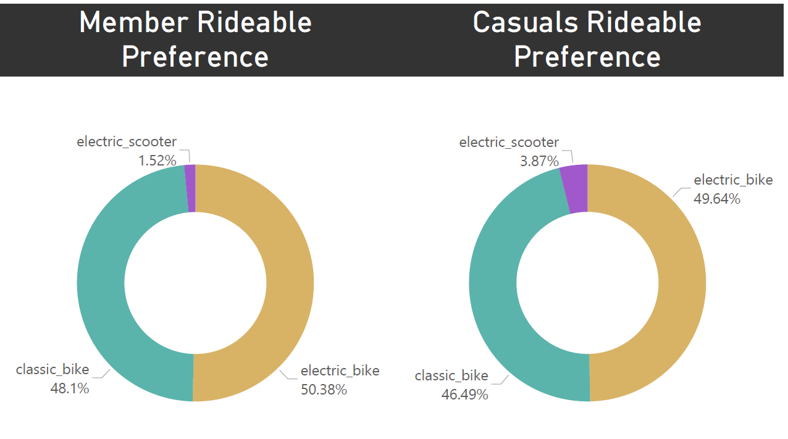

## Introduction
This analysis explores the behavioral differences between annual members and casual riders in a bike-sharing service, with the goal of identifying effective strategies to convert casual riders into long-term members. By understanding how these two user groups differ in their riding patterns, we can uncover valuable insights to drive business growth through targeted conversion initiatives.

 

## Dataset Overview

This analysis examines **5,607,186 bike rides** from the city of Chicago during 2024. The dataset captures basic ride information including timestamps, locations, durations, bike and rider types.

**Key Dataset Characteristics:**
- **Timeframe:** 1/1/2024 to 12/31/2024
- **User Composition:** 63.46% member rides (3,558,470), 36.54% casual rides (2,048,716)
- **Geographic Coverage:** 1,343 stations across Chicago
- **Bike Types:** Electric bikes (50.11%), classic bikes (47.51%), electric scooters (2.38%)

> **Note:** For analytic clarity, rides shorter than 2 minutes or longer than 10 hours (representing approximately 4.2% of the original data) were excluded as they likely represent system errors rather than actual customer behavior.

 

## Temporal Analysis: When They Ride

Understanding *when* members and casual riders use the bike-sharing service reveals fundamental differences in their usage patterns and helps identify potential conversion opportunities. Let's examine how ridership varies across different time scales, starting with monthly patterns.

### Monthly Ridership Patterns

**Key Observations:**
- Both member and casual rides follow similar seasonal patterns, peaking in summer months and declining during winter
- Member ridership consistently outpaces casual ridership across all months
- The gap between the two widens mostly during October and November
- The similar seasonal pattern suggests that weather and season affect both user groups similarly  

### Weekly Ridership Patterns

 Now let's see how ridership varies throughout the week. This reveals one of the most significant behavioral differences between member and casual riders.

 

 **Key Observations:**
- Members show consistently higher usage on weekdays, with peaks on Tuesday, Wednesday and Thursday
- Casual riders show dramatically higher usage on weekends, particularly on Saturdays
- During the weekend the two groups approach each other
- The greatest disparity occurs midweek (Tuesday-Thursday) when member rides are more than double from casual rides  

Statistical Findings:

- There is a statistically significant association between rider type and day of week (p < 0.001).  
- Members are significantly overrepresented on weekdays and underrepresented on weekends.  
- Casual riders show the opposite pattern, with significant overrepresentation on weekends.  

**Comments:**

- This pattern strongly suggests members use bikes for regular commuting, while casual riders mainly use the service for recreational purposes  
- Weekend casual riders represent a distinct segment with different needs than weekday users  
- Conversion strategies could target frequent weekend casual riders with weekend-focused membership options  

### Hourly Usage Patterns

After examining weekly trends, a deeper look at hourly patterns reveals perhaps the most telling difference between member and casual riders.

**Key Observations:**
- Member rides show a distinctive, bimodal distribution with sharp peaks during the morning (8-9AM) and evening (5-6PM)  
- Casual rides follow a unimodal distribution that gradually builds throughout the day, peaking also in the evening (5-6AM)  
- The morning commute peak is almost exclusively driven by members, with casual ridership notably lower during these hours

Let's examine how these patterns vary between weekdays and weekends:

- On weekdays, member riding patterns strongly indicate commuting behavior with pronounced morning and evening peaks
- On weekends, both member and casual riders follow similar unimodal patterns centered around midday
- The stark difference between weekday and weekend patterns for members suggests different use cases (commuting vs. leisure)
- Casual riding patterns remain relatively consistent between weekdays and weekends, with only timing shifts (peak lasts longer, 1-5PM)  

Statistical Findings:

- The Kolmogorov-Smirnov test confirms a significant difference between member and casual hourly distributions (p < 0.001)  
- The greatest differences occur during morning commute hours (7-9AM) and midday hours (2-3PM)  

**Comments:**
- This hourly usage analysis provides strong evidence that members and casual riders have fundamentally different use cases for the bike-sharing service  
- A small but potentially valuable segment appears: casual riders who use bikes during 8-9AM and 5-6AM on weekdays. These users already exhibit member-like behavior and may be most receptive to membership conversion efforts.

 

## Behavioral Analysis: How They Ride

After understanding when members and casual riders use the service, let's examine how they use it - specifically looking at ride durations and equipment preferences.

### Ride Duration Analysis

The duration of rides represents one of the most significant behavioral differences between member and casual riders.

**Key Observations**  
- Casual riders take longer trips than members (median ~13 minutes vs. ~9 minutes)  
- The interquartile range for casual riders is much wider, indicating greater variability in trip length  
- Casual riders show longer durations across all bike types, with the difference most pronounced for classic bikes   

Let's examine how these patterns change between weekdays:

And weekends:  

- The duration gap persists in both time periods 
- Weekend rides last longer and show higher variability for both groups  
- The member ratio differs significantly - members represent 68% of weekday rides but only 52% of weekend rides  
- Classic bikes show the largest duration gap in both periods  

Statistical Findings:

- There is a statistically significant difference in ride durations beyond our 8-minute threshold (p < 0.01)
- Casual riders take trips that are approximately 8.5 minutes longer than members on average

**Comments:**

- The consistent duration difference reinforces the idea that members primarily use bikes for practical transportation (shorter, purposeful trips), while casual riders use the service more for leisure and exploration (longer, less time-sensitive trips)
- For leisure-focused casuals, we can emphasize on cost saving for longer rides  

### Bike Type Preferences

Next, let's examine whether members and casual riders exhibit different preferences for bike types.

**Key Observations:**

- Both member and casual riders show remarkably similar preferences for bike types  
- Electric bikes are slightly preferred over classic bikes by both groups (around 50%)  
- From the previous graphs, we have that classic bike rides tend to last longer

**Comments:**

- Thiis similarity shows that, when and how long people ride are not driven by equipment choice  

 

## Spatial Analysis: Where They Ride

After understanding when and how members and casual riders use the service, examining where they ride completes our comprehensive analysis and reveals critical geographic insights for targeted conversion strategies.

### Geographic Usage Patterns

The heat maps reveal the spatial distribution of member and casual rides across Chicago:

**Key Observations:**  
- Both user types show concentrated activity in downtown Chicago and along the lakefront  
- The intensity patterns show subtle but important differences in neighborhood usage  
- Member activity extends more broadly into residential neighborhoods  

### Divergent Usage Areas

Some areas show dramatically different usage patterns between the two rider types:

**Key Observations:**

- Left map: Concentrated along the lakefront, particularly near tourist attractions like Navy Pier, Millennium Park, and museum campuses  
- Right map: More broadly distributed throughout residential neighborhoods and business districts, with strong presence in areas with higher population density and transit connections  

**Comments:**
- This geographic divergence reinforces our previous findings - members use bikes mainly for everyday transportation throughout the city, while casual riders concentrate in recreational and tourist areas.  

### High-Potential Conversion Stations

By analyzing stations with nearly equal member and casual usage, we can identify prime locations for targeted conversion efforts.

**Station Selection Criteria:**

- Member-to-casual ratio between 0.8 and 1.2 (similar usage patterns)  
- High volume of casual rides (minimum 500+ casual rides)   

**Key Observations:**

- High-volume conversion targets like Indiana Ave & Roosevelt Rd (11,631 casual rides) represent significant opportunities  
- Many target stations are located at the intersection of recreational areas and residential/business districts  
- Several stations are near universities and transit hubs 

**Comments:**

- The geographic distribution allows for targeted marketing campaigns in specific neighborhoods 
- Station-based conversion campaigns could focus on these high-potential locations   
- The identified conversion target stations represent the physical touchpoints where casual riders already exhibit behavior similar to members  

 

## Data-Driven Recommendations

Based on the patterns identified in this analysis, the following opportunities exist for converting casual riders to annual members:

1) **Weekend-Focused Membership Options:** Develop membership tiers that provide greater value for weekend usage patterns.  

2) **Long Ride Incentives:** Casual riders take significantly longer trips than members. Consider pricing structures that reward longer rides to appeal to this demonstrated behavior.

3) **Time Of Day Targetting:** Target the 12-3PM time block when casual ridership is at its highest relative to member ridership, as well as the specific segment of 8-9AM on weekdays.

4) **High-Potential Station Clusters Prioritization:** Focus marketting efforts on the top stations with balanced member/casual ratios as they suggest areas with higher conversion potential.

5) **Seasonal Conversion Timing:** Target conversion efforts during May-June period when casual ridership increases significantly compared to previous months, thus representing a high opportunity period.

6) **Potential customer segments**: Keep an eye on casual riders using bikes during typical commute hours on weekdays, and weekend riders with consistent patterns of recreational use>
